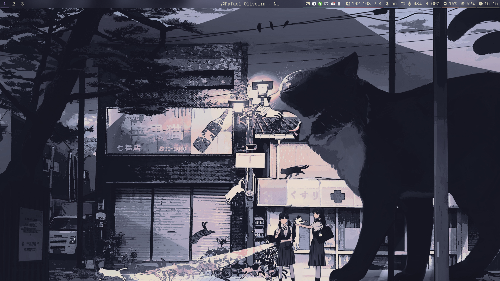

# Andrewix — NixOS + Home Manager Config

Personal NixOS + Home Manager config using flake-parts with dendritic architecture.

## Quick Start

```bash
just switch <host>        # Apply config
just test <host>          # Validate (requires sudo)
just check                # Eval errors
just update               # Update flake inputs (commits lock)
just fmt && just lint     # Format + lint
```

Hosts: `andrew-laptop`, `andrew-pc`, `andrew-home-wsl`, `andrew-work-wsl`.
Default host auto-detected via `hostname -s`.

### No Justfile?

```bash
nix run .#<host> -- switch
nix run .#<host> -- test
nix flake check
nix flake update --flake .
alejandra . && statix check && deadnix --no-underscore --fail
```

## Fresh Install

Provisions disks declaratively via [disko](https://github.com/nix-community/disko) —
no manual partitioning. Wipes the target disk (btrfs `@`/`@home`/`@nix` + swapfile,
vfat ESP).

> **Before installing**, hand disk ownership to disko: in
> `modules/core/hardware/disko.nix` set `disko.enableConfig = true`, and delete the
> `fileSystems`/`swapDevices` blocks from the target host's
> `hosts/<host>/_nixos/hardware-configuration.nix`. (They are kept `false`/by-uuid so
> `just switch` stays safe on the currently-running ext4 machines.)

1. Boot the [NixOS minimal ISO](https://nixos.org/download) and connect to network.

1. Find the target disk:

   ```bash
   lsblk           # e.g. /dev/nvme0n1
   ```

1. Partition + format + install in one step (`--disk main <device>` picks the disk):

   ```bash
   sudo nix --experimental-features "nix-command flakes" run \
     github:nix-community/disko/latest#disko-install -- \
     --flake github:hoanhxlyn/andrewix#andrew-pc --disk main /dev/nvme0n1
   ```

   Guided alternative (disk picker + confirm): clone the repo and run `./install.sh`.

1. Reboot. Log in as `andrew` / `admin123`, then:

   ```bash
   passwd                                    # change the bootstrap password
   # copy the shared age key so secrets decrypt (see Secrets below):
   #   ~/.config/sops-nix/keys.txt
   ```

Only `andrew-laptop` / `andrew-pc` are installable (WSL hosts have no disk layout).

## Architecture

| Path                   | Purpose                            |
| ---------------------- | ---------------------------------- |
| `modules/core/`        | All aspects (NixOS + Home Manager) |
| `modules/devices/`     | Per-device aspects (laptop, wsl)   |
| `modules/defaults.nix` | Default includes for all hosts     |
| `modules/hosts.nix`    | Host definitions                   |
| `hosts/<host>/_nixos/` | Hardware configs                   |
| `secrets/`             | sops-nix encrypted secrets         |
| `config/`              | Non-Nix app configs                |
| `flake.nix`            | **Auto-generated. DO NOT EDIT.**   |

Aspects auto-discovered. Compose via `den.aspects.<name>.includes` with angle-bracket imports (`<core/sound>`, `<core/shell>`).

## Garbage Collection

```bash
just gc        # User store
just clean-up  # System-wide + delete old gens (sudo)
```

## Secrets

Encrypted with [sops-nix](https://github.com/Mic92/sops-nix) using a shared age key.
Only available on workstation hosts (`andrew-laptop`, `andrew-pc`) — not WSL.

- **Encrypted file:** `secrets/secrets.yaml` (safe to commit)
- **Age key location:** `~/.config/sops-nix/keys.txt` on each host
- **Edit secrets:** `sops secrets/secrets.yaml`
- **Setup new host:** copy the shared age private key to `~/.config/sops-nix/keys.txt`
- **Add a new secret:** edit `secrets/secrets.yaml` (via `sops`) then
  declare it in `modules/core/services/sync/sops.nix` under `sops.secrets`

## More

See `AGENTS.md` for conventions, module patterns, and rules.

## Galerry

\[ \]
